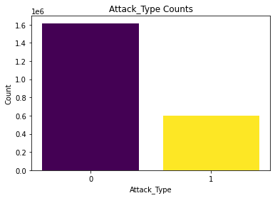
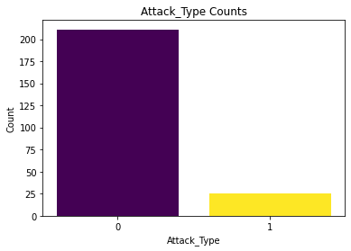

## Edge-IIoTset Dataset
Edge IIoT stands for Edge Industrial Internet of Things, refers to the deployment of IIoT technology close to the source of data generation (e.g., sensors, devices, and machines in a factory) rather than in a centralized data center.
- This dataset is available on Kaggle through API on https://www.kaggle.com/datasets/mohamedamineferrag/edgeiiotset-cyber-security-dataset-of-iot-iiot.
- Five basic categories of threats are included in the dataset which are DoS/DDoS attacks, Information gathering, Man in the middle attacks, Injection attacks, and Malware attacks.
- There are 2219201 rows and 63 columns in the dataset including the target column.
- Each row represents 1 network traffic, and 1615643 rows are normal traffics while 603558 are attacks.

  

- ## Malware on IoT Dataset
Same as the IoT-23 dataset, this dataset also belongs to Aposemat Project hosted by Avast. One of the main goals of this project is to obtain and use real IoT malware to infect the devices in order to create up to date datasets for research purposes. 
- The dataset is hosted on https://www.stratosphereips.org/datasets-iot.
- This dataset does not have an API but can be downloaded using wget in Python through https://mcfp.felk.cvut.cz/publicDatasets/IoTDatasets/CTU-IoT-Malware-Capture-49-1/
- Similar to IoT-23, this dataset also have many different subsets, for now I have only uploaded one of the malware subsets. If needed, more samples can be downloaded using the same process.
- Five basic categories of threats are included in the dataset which are DoS/DDoS attacks, Information gathering, Man in the middle attacks, Injection attacks, and Malware attacks.
- Unlike the Edge-IIoTset dataset which has traffics as rows, in this dataset each row is a NetFlow which means is a feature that was introduced on Cisco routers around 1996 that provides the ability to collect IP network traffic as it enters or exits an interface. In general, traffics that share 7 attributs, Ingress interface (SNMP ifIndex), Source IP address, Destination IP address, IP protocol number, Source port for UDP or TCP (0 for other protocols), Destination port for UDP or TCP or type & code for ICMP (0 for other protocols), and IP Type of Service will be conbined into a  unidirectional sequence of packets which is a flow.
- There are 236 rows and 23 columns including 2 label columns. One lable column is similar to the other dataset which is Benign and Malicisou, the other label column is the specific type of attacks which will probably be dropped for this project.

  

